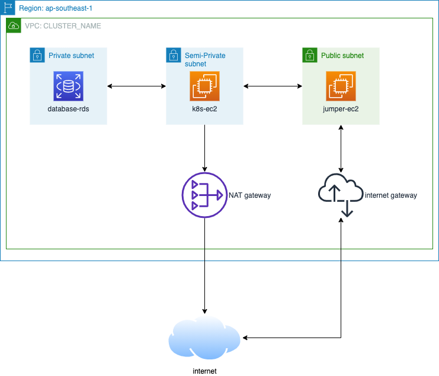

## Tech Stack

### Provisioning
- Infrastructure : terraform - [snippet here](https://github.com/victoralexanderds/infrastructure/tree/main/provisioning/terraform)
- k8s cluster: kops - [snippet here](https://github.com/victoralexanderds/infrastructure/tree/main/provisioning/kops)
    > Terraform and kops can be used in multiple platform and cloud

### Application
- Base: containerize
- Hub: AWS ECR
    > dockerize application so it can be shipped in k8s or docker. 
    > assume using AWS, will use AWS ECR as docker hub

### Managed Service:
- Casandra: AWS Keyspace
- PostgreSQL: RDS PostgreSQL
- Using managed service:
    - Effective administration – No need to maintain the OS
    - Scalability and Cost

## Step
1. **Infrastructure Provisioning**
    - Terraform, will create infrastructure:
        - VPC     : with CIDR 10.0.0.0/16 for staging
        - Subnet  : 3 subnet (public, private and private with nat) / zone
        - Route   : Internal, Public and with NAT
        - Security Group  : Base sec-group ssh and web http(s)
        - Managed Service   : AWS Keyspace and RDS PostgreSQL
    
    - k8s cluster with kops:
        -  kops will create k8s cluster on top of VM
        -  Master : 1 per zone
        -  Worker : start with 1 per zone with as enabled

    - Diagram:
        

2. **CI/CD Pipeline**   
    
    - Developer will have an access to ci/cd and can trigger build and deploy to staging by themself

3. **Application Deployment**
    - CI/CD : Jenkins if using github or gitlab-ci if using gitlab
    - k8s deployment : helm (package manager for k8s)
    - Diagram application manifest
    
